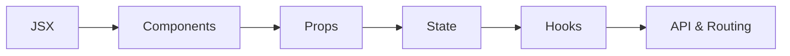

<div align="center">

# ⚛️ ReactJS Starter Project

**A clean, beginner-friendly foundation for modern React applications**

[](https://react.dev)
[](https://vitejs.dev)
[](LICENSE)
[](#-contributing)

Build reusable components, understand essential React concepts, and practice common beginner interview questions.

[🚀 Get Started](#-getting-started) · [📚 Learn React](#️-beginner-learning-roadmap) · [🧠 Practice](#-practice-challenge) · [🤝 Contribute](#-contributing)

</div>

---

## 📑 Table of Contents

- [About This Project](#-about-this-project)
- [Features](#-features)
- [Technology Stack](#️-technology-stack)
- [Getting Started](#-getting-started)
- [Available Scripts](#-available-scripts)
- [Project Structure](#-project-structure)
- [Basic Component Example](#-basic-component-example)
- [Beginner Learning Roadmap](#️-beginner-learning-roadmap)
- [Basic React Questions](#-basic-react-questions)
- [Practice Challenge](#-practice-challenge)
- [Production Build](#-production-build)
- [Contributing](#-contributing)
- [License](#-license)

---

## ✨ About This Project

This project is a simple ReactJS starter designed for beginners. It demonstrates the core ideas required to build an interactive single-page application, including components, props, state, Hooks, event handling, lists, forms, and conditional rendering.

> **Tip:** Replace this introduction with a short explanation of your actual application, its purpose, and the problem it solves.

## 🌟 Features

| Feature | Description |
|---|---|
| 🧩 Reusable components | Build the interface from small, independent components |
| 🪝 React Hooks | Manage state and side effects with modern React |
| 📱 Responsive UI | Create layouts that work across different screen sizes |
| ⚡ Fast development | Use Vite for a quick development and build experience |
| 🗂️ Clean structure | Keep components, pages, assets, and services organized |
| 📖 Learning section | Revise basic React questions directly from the README |

## 🛠️ Technology Stack

<div align="center">

| Frontend | Language | Styling | Build Tool |
|:---:|:---:|:---:|:---:|
| <br>ReactJS | <br>JavaScript | <br>CSS3 | <br>Vite |

</div>

## 🚀 Getting Started

### Prerequisites

Make sure these tools are installed:

- [Node.js](https://nodejs.org/) 18 or later
- npm (included with Node.js)
- [Git](https://git-scm.com/)

Verify the installations:

```bash
node --version
npm --version
git --version
```

### Installation

1. **Clone the repository**

   ```bash
   git clone https://github.com/your-username/your-repository.git
   ```

2. **Enter the project directory**

   ```bash
   cd your-repository
   ```

3. **Install the dependencies**

   ```bash
   npm install
   ```

4. **Start the development server**

   ```bash
   npm run dev
   ```

5. **Open the application**

   Visit the local address shown in the terminal — usually [http://localhost:5173](http://localhost:5173).

> **Important:** Replace `your-username` and `your-repository` with your real GitHub username and repository name.

## 📜 Available Scripts

| Command | What it does |
|---|---|
| `npm run dev` | Starts the local development server |
| `npm run build` | Creates an optimized production build |
| `npm run preview` | Previews the production build locally |
| `npm run lint` | Finds possible code-quality problems |

## 📁 Project Structure

```
src/
├── assets/          # Images, icons, and static files
├── components/      # Small reusable UI components
├── pages/           # Page-level components
├── hooks/           # Custom React Hooks
├── services/        # API request functions
├── styles/          # Global and shared styles
├── App.jsx          # Root application component
└── main.jsx         # Application entry point
```

## 💡 Basic Component Example

```jsx
import { useState } from 'react';

function Counter() {
  const [count, setCount] = useState(0);

  return (
    <section>
      <h2>Count: {count}</h2>
      <button onClick={() => setCount((current) => current + 1)}>
        Increase
      </button>
    </section>
  );
}

export default Counter;
```

## 🗺️ Beginner Learning Roadmap



Follow the roadmap from left to right. Learn one concept, build a small example, and then move to the next.

## 📚 Basic React Questions

Click a question to reveal its answer.

<details>
<summary><strong>1. What is ReactJS?</strong></summary><br>

ReactJS is an open-source JavaScript library for building interactive user interfaces, especially single-page applications.
</details>

<details>
<summary><strong>2. What is a component?</strong></summary><br>

A component is a reusable piece of UI. A modern React component is usually a JavaScript function that returns JSX.
</details>

<details>
<summary><strong>3. What is JSX?</strong></summary><br>

JSX is a syntax extension that lets us write HTML-like markup inside JavaScript.

```jsx
const heading = <h1>Hello, React!</h1>;
```
</details>

<details>
<summary><strong>4. What are props?</strong></summary><br>

Props are read-only values passed from a parent component to a child component.

```jsx
function Welcome({ name }) {
  return <h2>Welcome, {name}!</h2>;
}
```
</details>

<details>
<summary><strong>5. What is state?</strong></summary><br>

State is data managed inside a component. When state changes, React re-renders the component and updates the relevant UI.
</details>

<details>
<summary><strong>6. What does the useState Hook do?</strong></summary><br>

The `useState` Hook adds state to a functional component and returns the current value plus a setter function.

```jsx
const [name, setName] = useState('Alex');
```
</details>

<details>
<summary><strong>7. What does the useEffect Hook do?</strong></summary><br>

The `useEffect` Hook synchronizes a component with an external system — for example, an API, timer, browser event, or document title.
</details>

<details>
<summary><strong>8. What is the difference between props and state?</strong></summary><br>

| Props | State |
|---|---|
| Passed by a parent | Managed by a component |
| Read-only for the receiver | Updated through a setter |
| Configures a component | Stores changing data |
</details>

<details>
<summary><strong>9. What is the Virtual DOM?</strong></summary><br>

The Virtual DOM is a lightweight in-memory representation of the UI. React uses it to determine which parts of the real DOM need to change.
</details>

<details>
<summary><strong>10. Why is a key used when rendering a list?</strong></summary><br>

A stable and unique `key` helps React identify which list items changed, moved, were added, or were removed.

```jsx
users.map((user) => <li key={user.id}>{user.name}</li>);
```
</details>

<details>
<summary><strong>11. How are events handled in React?</strong></summary><br>

React event names use camelCase and receive a function instead of a string.

```jsx
<button onClick={handleClick}>Click me</button>
```
</details>

<details>
<summary><strong>12. What is conditional rendering?</strong></summary><br>

Conditional rendering displays different elements depending on a condition.

```jsx
{isLoggedIn ? <Dashboard /> : <Login />}
```
</details>

<details>
<summary><strong>13. What is a controlled component?</strong></summary><br>

A controlled component is a form element whose current value is stored and updated through React state.
</details>

<details>
<summary><strong>14. What does lifting state up mean?</strong></summary><br>

Lifting state up means moving shared state to the closest common parent so multiple child components can use the same data.
</details>

<details>
<summary><strong>15. What is a Single-Page Application?</strong></summary><br>

A Single-Page Application loads one main HTML document and dynamically updates its content without reloading the entire page for each interaction.
</details>

## 🧠 Practice Challenge

Test your understanding before opening the answers above:

- [ ] Create and export a functional component.
- [ ] Pass a username from a parent component to a child.
- [ ] Build a counter with `useState`.
- [ ] Render an array with `map()` and unique keys.
- [ ] Show a login or dashboard component conditionally.
- [ ] Build a controlled text input.
- [ ] Fetch API data inside `useEffect`.
- [ ] Explain why Hooks must not be called inside loops or conditions.
- [ ] Move shared state into a common parent component.
- [ ] Create one reusable custom Hook.

**Memory Trick:** Remember the React basics as **C-P-S-H-R**:
`Components → Props → State → Hooks → Render`

## 📦 Production Build

Create the optimized build:

```bash
npm run build
```

The generated production files will be available inside the `dist` directory.

## 🤝 Contributing

Contributions are welcome!

1. Fork this repository.
2. Create a branch: `git checkout -b feature/amazing-feature`.
3. Commit the change: `git commit -m "Add amazing feature"`.
4. Push the branch: `git push origin feature/amazing-feature`.
5. Open a pull request.

## 📄 License

Distributed under the [MIT License](LICENSE).

## 👤 Author

**Name:Meyadur Rahman**
**Name:meyadurrahman777@gmail.com**

---

<div align="center">

⭐ If this project helps you, give the repository a star!

Made with ❤️ and ReactJS

[⬆ Back to top](#️-reactjs-starter-project)

</div>